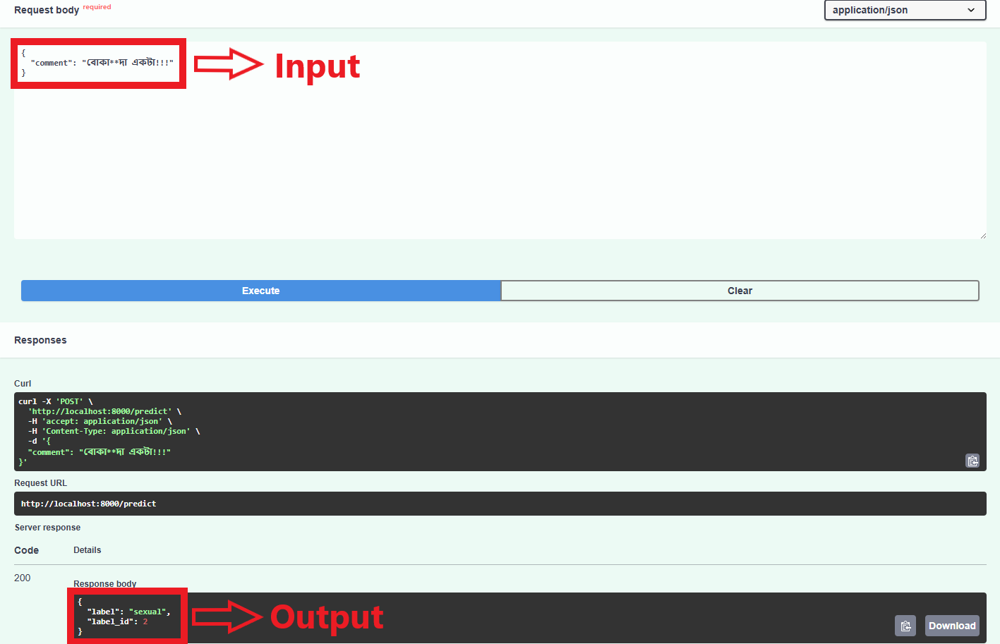

# Test Assignment for the AI/ML Intern Position - Technohaven

A technical assignment (Sentiment Analysis Classification) for "AI/ML Intern Position" position. Here, I have build a offensive language detection model for Bangla social media content using Bangla BERT, and deploy it via FastAPI.

## Dataset

The dataset used for training and evaluation is "Bangla Text Dataset" available on Github. You can find the dataset <a href="https://github.com/cypher-07/Bangla-Text-Dataset">here</a>. The data has been gathered and marked from the remark association area under public posts by celebrities, government officials, athletes on the Facebook stage. The total amount of collected comments is 44001 and labeled into five categories: Not Bully, Religious, Sexual, Troll, Threat. 

## Data Preprocessing

* Removed url's, emojis, punctuation and speacial characters, extra spaces
* Unicode normalization

## Proposed Methodology

* Load Dataset
* Data Preprocessing
* Label Encoding
* Tokenized using Pretrained Bangla BERT
* Trained using Bangla BERT Model
* Model Evaluation
* Save Model to ONNX
* FastAPI Deployment

## Experimental Setups
    
### Anaconda with VSCode
- **Environment:**
  - Python Version: 3.10.16 
  - Pytorch Version: 2.7.0
  - Processor: Intel i5 13400F
  - GPU: NVIDIA GeForce RTX 3060 (12 GB)
  - RAM: 16 GB
  - Storage: 512 GB NVMe SSD + 1 TB HDD
    

## Results
### Performance Evaluation of Bangla BERT Classification Model

|    Model    | Accuracy | Precision | Recall  | F1 Score |
|-------------|----------|-----------|---------|----------|
| Bangla BERT | 0.83786  |  0.82778  | 0.81482 | 0.82088  |

## FastAPI Deployment
### Prerequisites
- [Docker](https://docs.docker.com/get-docker/)

### Steps
1. Clone the repository and change directory:
   ```bash
   git clone https://github.com/SapphireFang1998/Test-Assignment-for-the-AI-ML-Intern-Position-Technohaven.git
   ```

2. As Bangla BERT model size is large, It can't possible to upload in github. Please, download the models folder from <a href="https://drive.google.com/drive/folders/1lZMo0rkP4KEh4srLvNlRdKLG4OB0Z2Qc?usp=sharing">here</a> and paste it to Bangla BERT folder.

3. Open an Integrated Terminal on Bangla BERT folder.

3. Build and start the Docker container:
   ```bash
   docker-compose build
   ```

   ```bash
   docker-compose build
   ```

3. Access the API at `http://localhost:8000` and Swagger UI at `http://localhost:8000/docs`.

4. On Swagger UI using browser, You'll see an interactive API — click on /predict → Try it out → enter your comment in the Request Body → Execute. You will get the sentiment label output in the Resposes body.

## Sample Images




## 5. Limitations & Future Improvements

- **Limitations:**
  - Model size is very high. Can't upload into gihub.
  - Have to test and tuned more combination of Hyperparameter to get optimal result

- **Future Improvements:**
  - Performance comparison between other BERT model like: BUET NLP, BERT Based Multilingual Cased etc.
  - Uploading the model into cloud server and access through cloud server API.

## Contact Information

- **Shamim Rahim Refat**
  - Email: [n.a.refat2000@gmail.com](mailto:n.a.refat2000@gmail.com)
