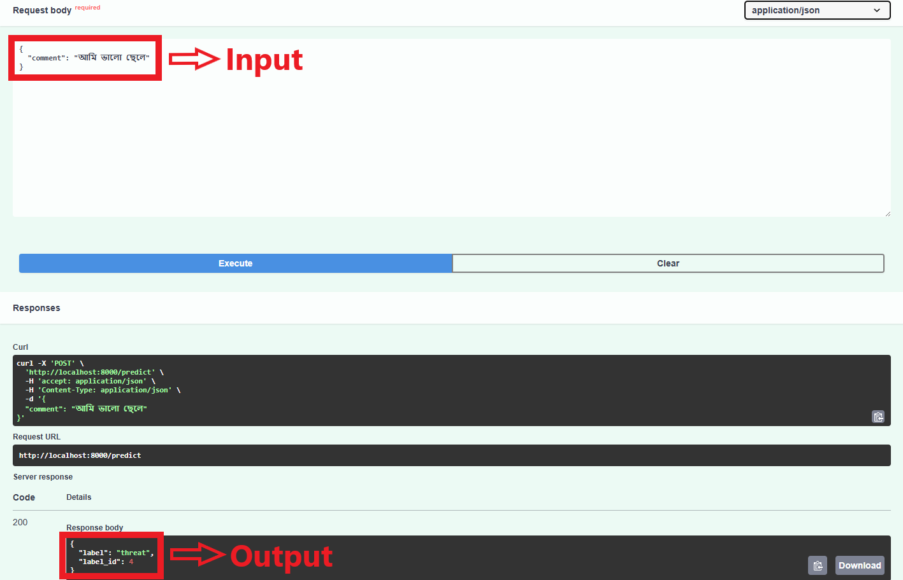
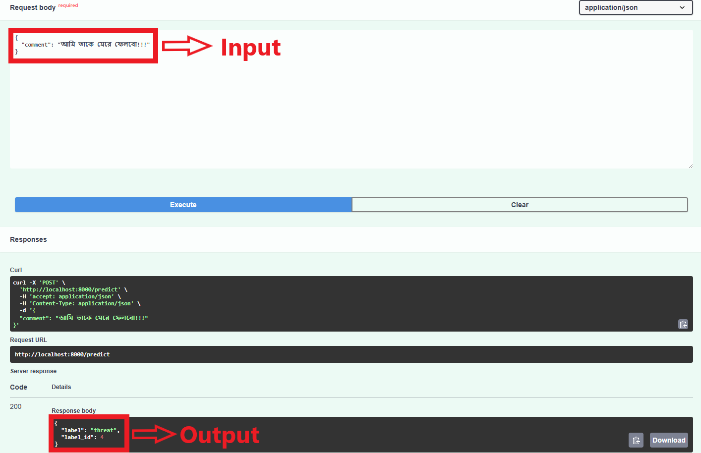

# Test Assignment for the AI/ML Intern Position - Technohaven

A technical assignment (Sentiment Analysis Classification) for "AI/ML Intern Position" position. Here, I have build a lightweight offensive language detection model for Bangla social media content using TF-IDF and Logistic Regression, and deploy it via FastAPI.

## Dataset

The dataset used for training and evaluation is "Bangla Text Dataset" available on Github. You can find the dataset <a href="https://github.com/cypher-07/Bangla-Text-Dataset">here</a>. The data has been gathered and marked from the remark association area under public posts by celebrities, government officials, athletes on the Facebook stage. The total amount of collected comments is 44001 and labeled into five categories: Not Bully, Religious, Sexual, Troll, Threat. 

## Data Preprocessing

* Removed url's, emojis, punctuation and speacial characters, extra spaces
* Unicode normalization

## Proposed Methodology

* Load Dataset
* Data Preprocessing
* Label Encoding
* TF-IDF Vectorization
* SMOTE Oversampling Technique to handle data imbalance
* Logistic Regression
* Model Evaluation
* Save Model to ONNX
* FastAPI Deployment

## Experimental Setups
    
### Anaconda with VSCode
- **Environment:**
  - Python Version: 3.10.16 
  - Processor: Intel i5 13400F
  - GPU: NVIDIA GeForce RTX 3060 (12 GB)
  - RAM: 16 GB
  - Storage: 512 GB NVMe SSD + 1 TB HDD
    

## Results
### Performance Evaluation of TF-IDF + Logistic Regression Classification Model

|        Model        | Accuracy | Precision | Recall  | F1 Score |
|---------------------|----------|-----------|---------|----------|
| Logistic Regression | 0.53051  |  0.47873  | 0.50685 | 0.47358  |

## FastAPI Deployment
### Prerequisites
- [Docker](https://docs.docker.com/get-docker/)

### Steps
1. Clone the repository and change directory:
   ```bash
   git clone <https://github.com/SapphireFang1998/Test-Assignment-for-the-AI-ML-Intern-Position-Technohaven.git>
   ```

2. Open an Integrated Terminal on TF-IDF + Logistic Regression folder

3. Build and start the Docker container:
   ```bash
   docker-compose build
   ```

   ```bash
   docker-compose up
   ```

3. Access the API at `http://localhost:8000` and Swagger UI at `http://localhost:8000/docs`.

4. On Swagger UI using browser, You'll see an interactive API — click on /predict → Try it out → enter your comment in the Request Body → Execute. You will get the sentiment label output in the Resposes body.

## Sample Images





## 5. Limitations & Future Improvements

- **Limitations:**
  - TF-IDF ignores word order and context, which may reduce performance on nuanced sentences.
  - Logistic Regression handles only linear decision boundaries.
  - A bug has in this project. For some reasons which I don't know, the model always show "Threat" Label in FastAPI in every Bangla Sentence. Tried a lot,but unable to solve it.

- **Future Improvements:**
  - Integrate deep-learning models (e.g., Bangla BERT) for contextual embeddings and deployment into FastAPI.


## Contact Information

- **Shamim Rahim Refat**
  - Email: [n.a.refat2000@gmail.com](mailto:n.a.refat2000@gmail.com)
